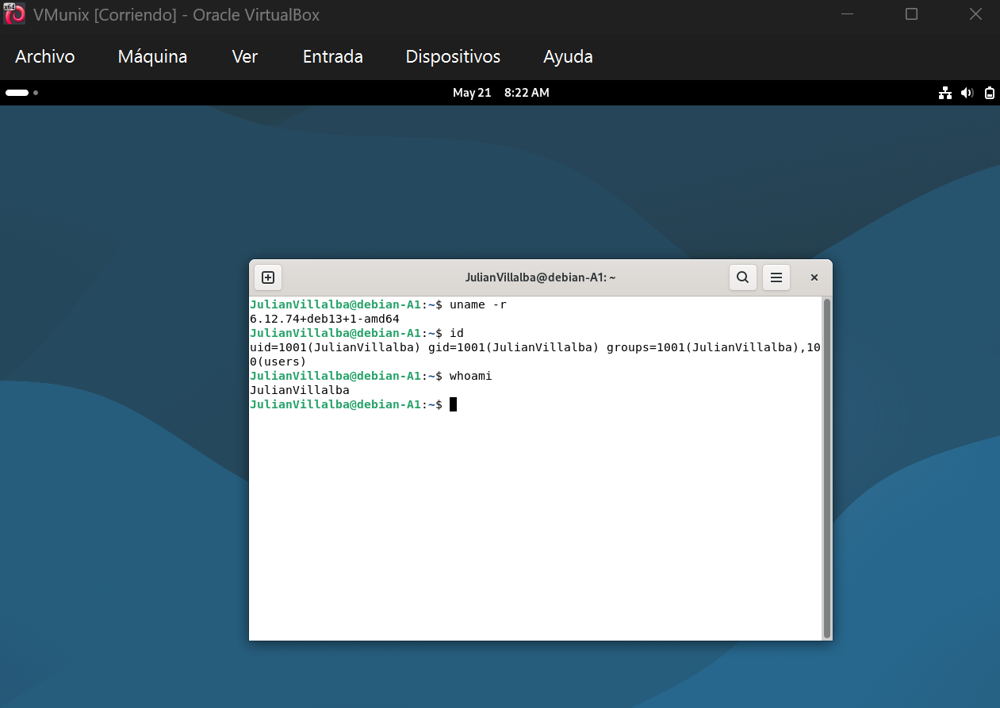
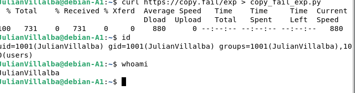
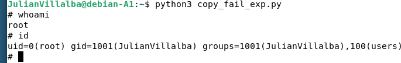
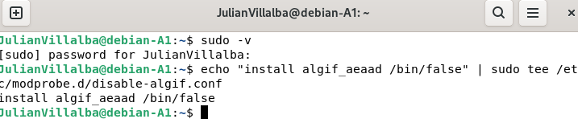
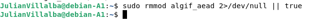
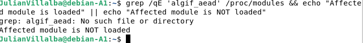

# Directorio de Evidencias

Aquí van los archivos que documentan tu progreso en cada hito.

## Archivos esperados

| Archivo | Hito | Descripción |
|---------|------|-------------|
| `hito1_vuln_confirmed.txt` | Hito 1 | Kernel corriendo, módulo algif_aead confirmado |
| `hito2_root_shell.txt` | Hito 2 | Salida del exploit con `uid=0(root)` |
| `hito3_mitigation.txt` | Hito 3 | Módulo removido, exploit fallando |
| `hito4_patched.txt` | Hito 4 | Exploit fallando en kernel parcheado |

## Reglas

1. **No copies** archivos de otro estudiante. El autocalificador verifica que el
   hostname de la VM (copy-fail-TUNOMBRE) sea consistente en todos los archivos.

2. **Cada archivo debe tener timestamp** del momento en que lo generaste.

3. **El hostname** en los archivos debe coincidir con tu STUDENT_ID.

## Cómo generar evidencias

Ver `CHALLENGE.md` para comandos exactos de cada hito.

Ejemplo rápido:
```sh
# Dentro de la VM QEMU, ejecuta el comando de evidencia del hito
# Luego copia el texto y guárdalo aquí
```


Hito 1, comprobar vulnerabilidad de la MV


descargar el script automatizado del exploit y verificar identidad


Ejecutar el exploit para corromper el Page Cache y Confirmar la escalación de privilegios exitosa


Hito 4 



Forzar la descarga del módulo de la memoria RAM de forma silenciosa


Verificar el modulo del sistema


